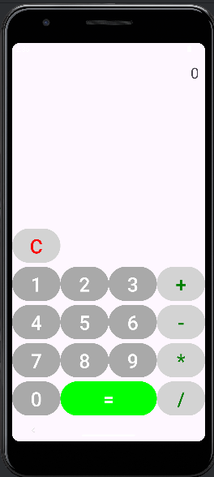

# Calculatrice Simple

Ce projet est une application de calculatrice simple pour Android.

## Fonctionnalités

- Calculs en chaîne (par exemple, `2 + 3 * 4`)
- Réinitialisation de la calculatrice
- Gestion des erreurs (comme la division par zéro)

- **** :
